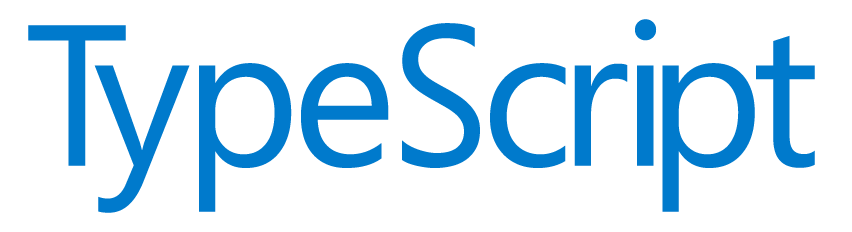

# Hola a todos! Soy [Bryant Paz Loeza a.k.a cachorro , a.k.a pazita !](https://github.com/amandewatnitrr) 
 

## 
<h4 align="center"><samp>Desarrollador web, intructor , Entusiasta de typescript  & futuro creador de contenido.</samp></h4>

 

- 👷 <samp>Desarrollador full stack con 3 años de experiencia diseñando y desarrollando soluciones web responsivas, mantenibles y escalables.Gran entusiasta de typescript y del uso de linters
-  🔭 <samp>Enseñando a las personas como volverse programadores de la manera más eficiente
- ✍🏻 <samp>Creando contenido multimedia en las plataformas digitales más populares para ayudar a las personas a recorrer un camino similar al mio pero de una manera más fácil
- ✍🏻 <samp>Trabajando como desarrollador full stack en javascript y aprendiendo y reforzando mis conocimientos
 
##

<h3><b><samp>Experiencia:</samp></b></h3>
- 👷 <samp>Full Stack con Javascript en H. Ayuntamiento de Yobaín ( Enero 2021 - Junio 2021 - 6 meses, Mérida ) 
- 🔬 <samp>Líder de Proyecto IoT en la Universidad Tecnológica Metropolitana ( Enero 2020 -  Diciembre 2020 - 1 año, Merida ) 
- 🕵🏻 <samp>Full Stack con Javascript en UADY de Hunucmá ( Enero 2019 - Diciembre 2019 - 1 año, Hunucmá ) 

##
<h3><b><samp>Habilidades y herramientas</samp></b></h3>

    
##

 
  